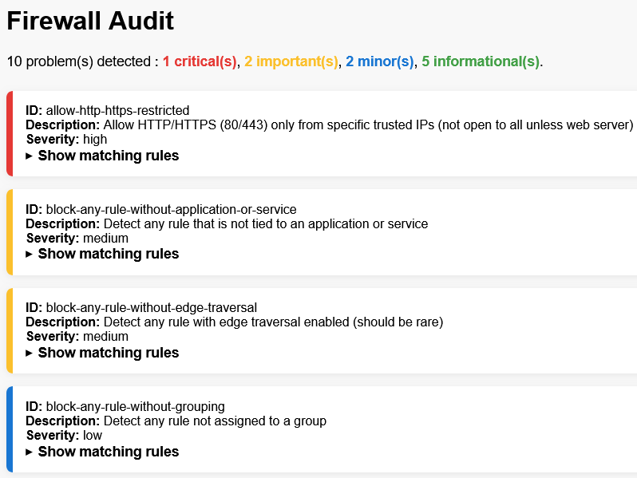

<div align="center">

<h1>Firewall Audit</h1>

[](https://crates.io/crates/firewall_audit)
[](https://github.com/lhenry-dev/firewall_audit/actions/workflows/ci.yml?branch=main)
[](https://deps.rs/repo/github/lhenry-dev/firewall_audit)
[](https://docs.rs/firewall_audit)
[](https://crates.io/crates/firewall_audit)
[](https://github.com/rust-lang/rust/releases/tag/1.78.0)
[](https://codecov.io/gh/lhenry-dev/firewall_audit)

</div>

---

**Firewall Audit** is a cross-platform command-line tool and for auditing firewall rules against user-defined security criteria. It helps security professionals, system administrators, and auditors automatically check firewall configurations for misconfigurations, policy violations, and best practices.

- Audit firewall rules using flexible, extensible criteria (YAML/JSON)
- Export audit results in HTML, JSON, CSV, or plain text
- Supports Windows (full), Linux (partial), and is extensible

---

## Quick Start (CLI)

### Installation

```sh
cargo install firewall_audit
```

### Usage

Audit your firewall rules using a YAML or JSON criteria file and export the results:

```sh
firewall_audit --criteria audit_criteria.yaml --export html --output result.html
```

- `--criteria`: Path to your audit criteria file (YAML or JSON)
- `--export`: Output format (`csv`, `html`, or `json`). If omitted, results are printed as plain text.
- `--output`: Output file path (optional; auto-generated if omitted)

## HTML Export Screenshot

Here is an example of the HTML report generated by `firewall_audit`:



The image above shows how audit results can be viewed in a browser after exporting to HTML format.

---

## What Does It Do?

- Loads firewall rules from the local system (Windows Firewall or Linux iptables)
- Loads user-defined audit criteria (YAML or JSON)
- Evaluates each firewall rule against all criteria
- Reports all rules that match any problematic criteria
- Exports results in your chosen format (HTML, JSON, CSV, or text)

---

## Example: Audit Criteria (YAML)

Below is a sample of what an audit criteria file can look like. Each rule defines a security check, its logic, and severity:

```yaml
- id: block-rdp-from-anywhere
  description: Block RDP (3389) from any source (should not be open to the world)
  criteria:
    and:
      - field: local_ports
        operator: matches
        value: 3389
      - field: protocol
        operator: equals
        value: "TCP"
      - field: action
        operator: equals
        value: "Allow"
      - field: remote_addresses
        operator: contains
        value: "0.0.0.0/0"
  severity: critical

- id: block-any-rule-without-description
  description: Detect any rule without a description (should be documented)
  criteria:
    and:
      - field: description
        operator: is_null
  severity: medium
```

You can also use JSON for your criteria files.

For more examples, see `docs/EXAMPLES.md`. For a complete reference of all supported fields and operators, see `docs/CRITERIA_REFERENCE.md`.

---

## Platform Support & Limitations

- **Windows:** Full support (uses Windows Firewall APIs; admin rights may be required)
- **Linux:** Partial support (parses `iptables` rules; some fields may be missing or incomplete)
- **macOS:** Not supported/tested

- **Criteria File Format:** Only YAML and JSON are supported for criteria files.
- **Firewall Modification:** This tool does **not** modify firewall rules; it only audits and reports.

---

## Support

For issues and questions:
- Open an issue on GitHub
- Check the [documentation](https://docs.rs/firewall_audit)

---

# License

This project is licensed under either of

 * Apache License, Version 2.0, ([LICENSE-APACHE](LICENSE-APACHE) or
   <https://www.apache.org/licenses/LICENSE-2.0>)
 * MIT license ([LICENSE-MIT](LICENSE-MIT) or
   <https://opensource.org/licenses/MIT>)

at your option.